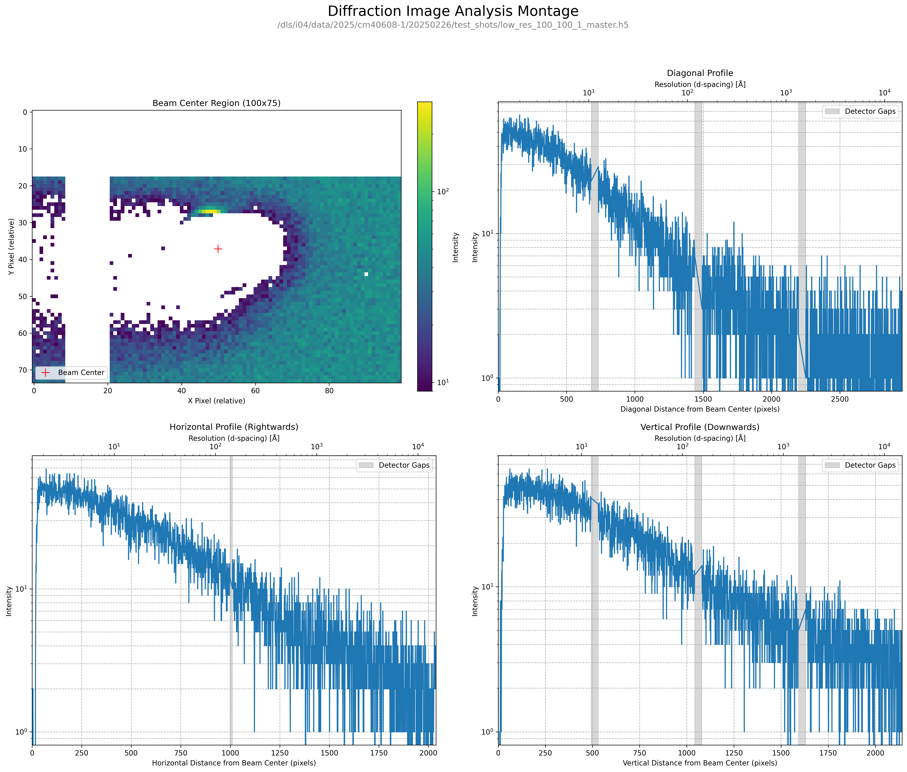

# Diffraction Image Analysis Tool

A Python-based application for generating diagnostic plots from MX diffraction images. This tool is designed to provide a quick quality control check, particularly for verifying beamstop alignment after changes in experimental setup (e.g., switching between low, standard, and high-resolution configurations).

This project was developed as a module for the [mx_beamline_setup](https://github.com/aragaod/mx_beamline_setup) quality control suite at the I04 beamline, Diamond Light Source, but is designed to be a standalone tool that can be adapted for use at other synchrotron beamlines.



---

## Key Features

-   **Montage Generation:** Creates a 2x2 montage including a 2D view of the beam center and 1D scattering profiles in vertical, horizontal, and diagonal directions.
-   **Individual Plots:** Each plot from the montage can be generated and saved as a separate image.
-   **Command-Line Interface:** A flexible CLI powered by `click` allows for easy customisation of plot parameters, input/output files, and profile directions.
-   **Library Usage:** The core logic is encapsulated in a `MontageGenerator` class, allowing it to be easily imported and integrated into larger data processing or analysis pipelines.
-   **Robust Data Handling:** Automatically detects detector bit depth (16/32-bit) to correctly identify detector gaps and handles unreliable metadata by using known physical constants.

---

## Installation & Setup

### 1. Clone the Repository
Clone or download this repository to your local machine.

### 2. Install Dependencies
It is recommended to use a virtual environment. Install the required Python packages using the `requirements.txt` file:

```bash
pip install -r requirements.txt
```

### 3. Download Example Data
This project requires example data files to run. The test datasets are archived on Zenodo.

1.  **Download the data archive** from the following DOI:
    [https://doi.org/10.5281/zenodo.15739324](https://doi.org/10.5281/zenodo.15739324)
2.  **Create a `data` directory** in the root of this project folder.
3.  **Unzip the archive** and place the contents (e.g., `low_res_100_100_1_master.h5` and its associated `_meta.h5` and `_..._000001.h5` files) into the `data` directory you just created.

**Citation for the dataset:**
> Aragao, D., & Diamond Light Source. (2025). Example Diffraction Datasets for Beamstop Alignment QC (Version 1.0) [Data set]. Zenodo. https://doi.org/10.5281/zenodo.15739324

---

## Usage

The application is run from the command line, pointing to an HDF5 master file inside the `data` directory.

### Generating the Full Montage
```bash
python generate_montage.py data/low_res_100_100_1_master.h5
```

### Generating Individual Plots
```bash
# Generate only the 2D beam center plot
python generate_montage.py data/low_res_100_100_1_master.h5 --plot-2d-only

# Generate only the vertical profile, going upwards
python generate_montage.py data/low_res_100_100_1_master.h5 --plot-vertical-only --vertical-up
```

### Getting Help
To see a full list of all available command-line options, use the `--help` flag:
```bash
python generate_montage.py --help
```

---

## Using as a Library

The core functionality can be easily integrated into other Python scripts. For practical, working examples, please see the scripts in the `/examples` directory.

A basic example is shown below:
```python
import matplotlib.pyplot as plt
from libs.analyser import MontageGenerator

# Use a relative path to the data file
master_file = 'data/low_res_100_100_1_master.h5'

analyser = MontageGenerator(master_file)
fig, ax = plt.subplots(figsize=(10, 6))
analyser.plot_1d_profile(ax, slice_type='vertical')
plt.show()
```

---

## Acknowledgements
Portions of this software were developed with assistance from Google's Gemini.

## License
This project is licensed under the Apache License, Version 2.0. See the [LICENSE](LICENSE) file for details.
