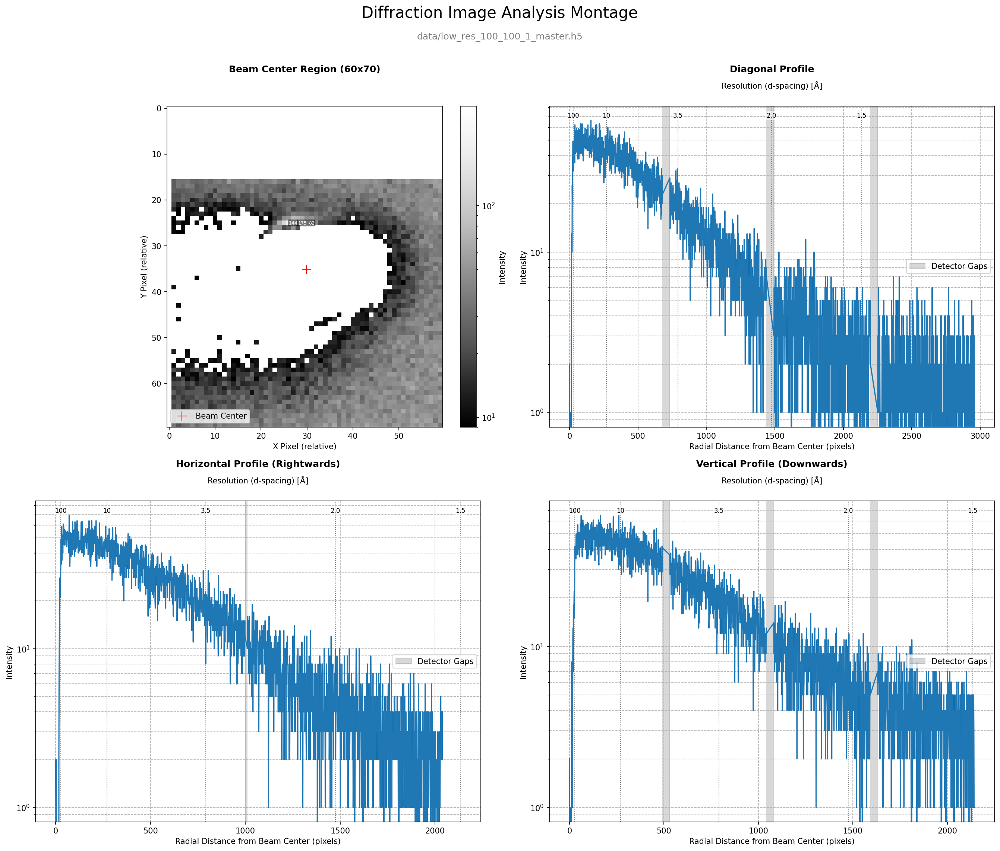
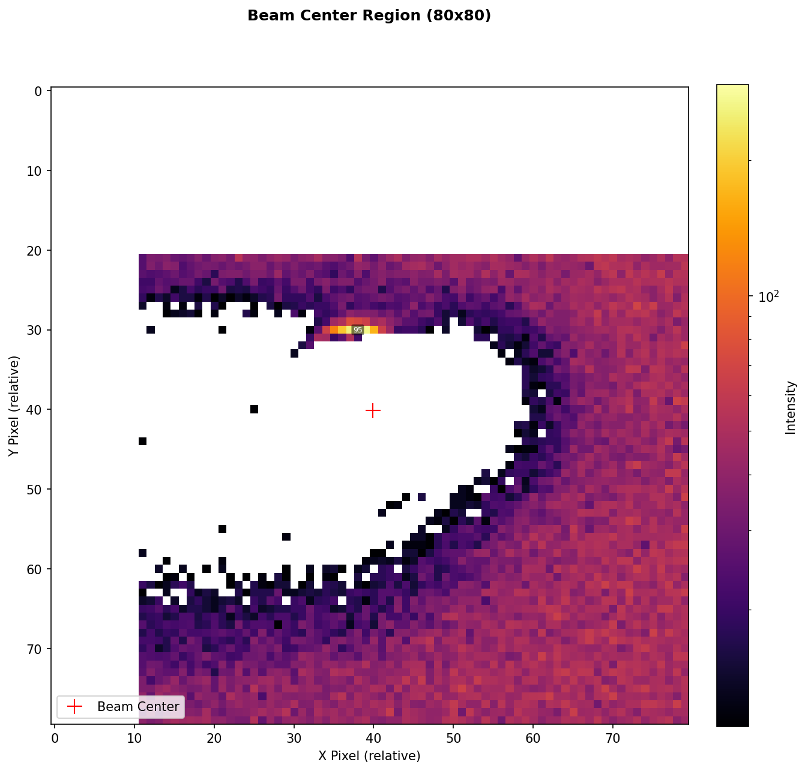

# Example Plot Outputs

This directory contains examples of the different plots and layouts that can be generated by the Diffraction Image Analysis Tool. These images are generated by the scripts located in the `/examples` directory.

---

### Full 4-Panel Montage

**File:** `montage_example.png`

This is the default output of the main script, providing a comprehensive overview in a single image. It includes:
- **Top-Left:** A 2D heatmap of the beam center region.
- **Top-Right:** A 1D intensity profile of a diagonal slice.
- **Bottom-Left:** A 1D intensity profile of a horizontal slice.
- **Bottom-Right:** A 1D intensity profile of a vertical slice.

---

### Two-Panel Montage

**File:** `two_panel_montage_example.png`

This layout combines the 2D beam center view with a single 1D profile, which is useful for a more focused analysis. This example shows the vertical profile, but horizontal or diagonal profiles can also be generated in this layout using the `--montage-type` option.

---

### Single Plot: 2D Beam Center

**File:** `beam_center_example.png`

A detailed, standalone view of the region immediately surrounding the beam center. This plot is ideal for checking for beam leakage past the beamstop and for precise visualization of the beam's shape and position. The overlaid numbers show the average intensity in binned pixel areas.

---

### Single Plot: 1D Vertical Profile

**File:** `vertical_profile_example.png`

This plot shows the intensity profile of a 1-pixel-wide vertical slice taken through the beam center. It is primarily used to detect unwanted diffraction or scattering that may arise from the top and bottom horizontal edges of the beamstop.

---

### Single Plot: 1D Horizontal Profile

**File:** `horizontal_profile_example.png`

This plot shows the intensity profile of a 1-pixel-wide horizontal slice taken through the beam center. It is useful for detecting issues with the left and right vertical edges of the beamstop.

---

### Single Plot: 1D Diagonal Profile

**File:** `diagonal_profile_example.png`

This plot shows the intensity profile of a diagonal slice taken from the beam center to the corner of the detector. This profile can be particularly useful for revealing asymmetries or scattering artifacts that may come from the corners or mounting hardware of the beamstop.

